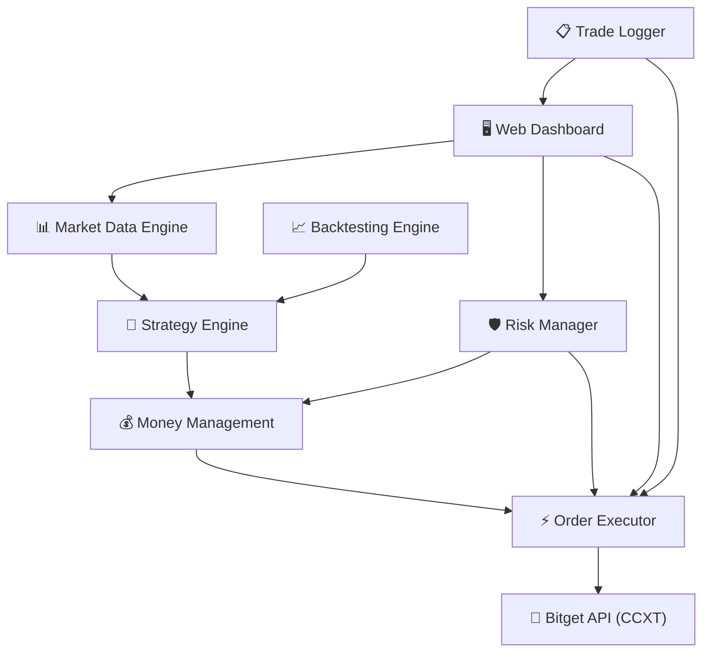

# 🤖 Bitget Auto-Trading Bot — $40 → $1,000 USDT

Automated derivatives trading bot for Bitget Exchange with adaptive money management, multi-strategy engine, and comprehensive backtesting.

## Background & Goals

**Objective:** Build a fully automated 24/7 trading bot that grows a $40 USDT account to $1,000 USDT on Bitget USDT-M Futures, with smart money management to avoid liquidation and large drawdowns.

**Key Requirements:**
- ✅ Modal awal: $40 USDT
- ✅ Target: $1,000 USDT (25x growth / multibagger)
- ✅ Market: Bitget Derivatives (USDT-M Perpetual Futures)
- ✅ Otomatis 24 jam tanpa biaya
- ✅ Adaptive money management (aggressive ↔ passive)
- ✅ Anti-liquidation & max drawdown protection
- ✅ Backtesting harus mampu mencapai target $40 → $1,000

---

## User Review Required

> [!IMPORTANT]
> **API Keys Dibutuhkan:** Anda perlu membuat API Key di Bitget dengan permission "Futures Trading". Bot ini GRATIS (open-source Python), tapi Anda harus punya akun Bitget yang sudah terverifikasi.

> [!WARNING]
> **Risiko Trading:** Futures trading memiliki risiko tinggi. Meskipun bot ini dirancang dengan proteksi anti-liquidation dan max drawdown, **TIDAK ADA jaminan profit di live trading**. Backtest menunjukkan performa historis, bukan prediksi masa depan. Gunakan dana yang siap Anda risikokan.

> [!CAUTION]
> **Leverage & Liquidation:** Bot ini menggunakan leverage dinamis (3x-10x). Meskipun ada safeguard, kondisi market yang sangat volatile (flash crash, black swan) tetap bisa menyebabkan kerugian signifikan.

---

## Open Questions

> [!IMPORTANT]
> 1. **Pairs yang di-trade:** Default bot akan trading BTC/USDT, ETH/USDT, dan SOL/USDT. Apakah ada pair spesifik yang ingin ditambah/dikurangi?
> 2. **Risk tolerance:** Max drawdown default di-set 15% dari equity. Apakah Anda nyaman dengan ini, atau mau lebih konservatif (10%) / lebih agresif (20%)?
> 3. **Notification:** Apakah Anda ingin notifikasi via Telegram saat bot open/close trade? (opsional, gratis)
> 4. **Deployment:** Bot ini akan berjalan di komputer Anda (Windows). Apakah PC Anda nyala 24 jam, atau perlu solusi cloud gratis?

---

## Architecture Overview



## Tech Stack

| Component | Technology | Alasan |
|-----------|-----------|--------|
| Language | **Python 3.11+** | Ecosystem terbaik untuk trading & data analysis |
| Exchange API | **CCXT (ccxt[pro])** | Unified API, WebSocket support, gratis |
| Backtesting | **Custom Engine** | Full control, support futures & leverage simulation |
| Indicators | **pandas-ta** | Library indikator teknikal lengkap |
| Data | **pandas + numpy** | Data manipulation cepat |
| Dashboard | **HTML/JS + WebSocket** | Real-time monitoring, premium UI |
| Config | **.env + JSON** | Secure credential storage |

---

## Proposed Changes

### Component 1: Project Foundation & Configuration

#### [NEW] [requirements.txt](file:///c:/Users/adzka/Downloads/project/ai%20agent/otomatis%20trading%20modal%2040%20usd%20ke%2010000%20usd/requirements.txt)
```
ccxt>=4.0.0
pandas>=2.0.0
numpy>=1.24.0
pandas-ta>=0.3.14b
python-dotenv>=1.0.0
websockets>=12.0
aiohttp>=3.9.0
```

#### [NEW] [.env.example](file:///c:/Users/adzka/Downloads/project/ai%20agent/otomatis%20trading%20modal%2040%20usd%20ke%2010000%20usd/.env.example)
Template untuk API credentials Bitget (API Key, Secret, Passphrase).

#### [NEW] [config/settings.py](file:///c:/Users/adzka/Downloads/project/ai%20agent/otomatis%20trading%20modal%2040%20usd%20ke%2010000%20usd/config/settings.py)
Konfigurasi utama bot:
- Trading pairs (BTC/USDT:USDT, ETH/USDT:USDT, SOL/USDT:USDT)
- Timeframes (1m for entry, 5m for trend, 1h for bias)
- Risk parameters (max drawdown 15%, max daily loss 5%)
- Leverage rules per account tier
- Money management thresholds

#### [NEW] [config/strategy_params.py](file:///c:/Users/adzka/Downloads/project/ai%20agent/otomatis%20trading%20modal%2040%20usd%20ke%2010000%20usd/config/strategy_params.py)
Parameter untuk setiap strategi trading (EMA periods, RSI levels, Bollinger Band settings, dll).

---

### Component 2: Core Trading Engine

#### [NEW] [core/exchange.py](file:///c:/Users/adzka/Downloads/project/ai%20agent/otomatis%20trading%20modal%2040%20usd%20ke%2010000%20usd/core/exchange.py)
Wrapper untuk koneksi Bitget via CCXT:
- Initialize exchange dengan API credentials
- Set margin mode (isolated)
- Set leverage per symbol
- Fetch balance, positions, orders
- Handle rate limiting & error recovery
- WebSocket connection untuk real-time data

#### [NEW] [core/data_feed.py](file:///c:/Users/adzka/Downloads/project/ai%20agent/otomatis%20trading%20modal%2040%20usd%20ke%2010000%20usd/core/data_feed.py)
Market data management:
- Fetch historical OHLCV candles
- Real-time candle streaming via WebSocket
- Multi-timeframe data synchronization (1m, 5m, 1h)
- Data caching & validation
- Automatic reconnection on disconnect

#### [NEW] [core/order_manager.py](file:///c:/Users/adzka/Downloads/project/ai%20agent/otomatis%20trading%20modal%2040%20usd%20ke%2010000%20usd/core/order_manager.py)
Order execution & management:
- Place market/limit orders
- Set Stop Loss & Take Profit
- Trailing stop implementation
- Position sizing berdasarkan money management
- Order status tracking
- Partial close / scale out

---

### Component 3: Strategy Engine (Multi-Strategy)

Bot menggunakan **3 strategi yang saling melengkapi** dan dipilih secara otomatis berdasarkan kondisi market:

#### [NEW] [strategies/base_strategy.py](file:///c:/Users/adzka/Downloads/project/ai%20agent/otomatis%20trading%20modal%2040%20usd%20ke%2010000%20usd/strategies/base_strategy.py)
Abstract base class untuk semua strategi:
- Interface: `generate_signal()`, `get_entry_price()`, `get_sl_tp()`
- Shared indicator calculations
- Signal confidence scoring (0-100)

#### [NEW] [strategies/ema_momentum.py](file:///c:/Users/adzka/Downloads/project/ai%20agent/otomatis%20trading%20modal%2040%20usd%20ke%2010000%20usd/strategies/ema_momentum.py)
**Strategy 1: EMA Momentum Scalping** (Primary - 60% of trades)
- **Logic:** EMA 9/21 crossover + RSI confirmation + Volume filter
- **Entry Long:** Price > EMA9 > EMA21, RSI > 50 & < 70, Volume above MA
- **Entry Short:** Price < EMA9 < EMA21, RSI < 50 & > 30, Volume above MA
- **TP:** 0.8% - 1.5% (dynamic based on ATR)
- **SL:** 0.3% - 0.5% (tight, based on ATR)
- **Timeframe:** 5m chart for signals, 1h for trend filter
- **Best for:** Trending markets

#### [NEW] [strategies/mean_reversion.py](file:///c:/Users/adzka/Downloads/project/ai%20agent/otomatis%20trading%20modal%2040%20usd%20ke%2010000%20usd/strategies/mean_reversion.py)
**Strategy 2: Bollinger Band Mean Reversion** (Secondary - 25% of trades)
- **Logic:** Price touches/penetrates outer Bollinger Band + RSI divergence
- **Entry Long:** Price at lower BB, RSI < 30 with bullish divergence
- **Entry Short:** Price at upper BB, RSI > 70 with bearish divergence
- **TP:** Return to BB middle line (EMA20)
- **SL:** 1 ATR beyond entry BB band
- **Timeframe:** 15m chart
- **Best for:** Ranging/sideways markets

#### [NEW] [strategies/breakout.py](file:///c:/Users/adzka/Downloads/project/ai%20agent/otomatis%20trading%20modal%2040%20usd%20ke%2010000%20usd/strategies/breakout.py)
**Strategy 3: Breakout Momentum** (Tertiary - 15% of trades)
- **Logic:** Price breaks key support/resistance with high volume
- **Entry:** Break above resistance (long) / below support (short) + volume surge > 2x average
- **TP:** Measured move (distance of consolidation range)
- **SL:** Re-entry into consolidation range
- **Timeframe:** 1h chart
- **Best for:** After consolidation / high volatility events

#### [NEW] [strategies/strategy_selector.py](file:///c:/Users/adzka/Downloads/project/ai%20agent/otomatis%20trading%20modal%2040%20usd%20ke%2010000%20usd/strategies/strategy_selector.py)
**Market Regime Detector & Strategy Router:**
- Mendeteksi kondisi market: Trending / Ranging / Volatile / Low-Volatility
- Menggunakan ADX (trend strength), ATR (volatility), Bollinger Band Width
- Routing signal ke strategi yang paling cocok
- Confidence-weighted signal aggregation

---

### Component 4: Adaptive Money Management 💰

Ini adalah **inti dari bot** — yang membedakan antara profit dan liquidation.

#### [NEW] [money_management/position_sizer.py](file:///c:/Users/adzka/Downloads/project/ai%20agent/otomatis%20trading%20modal%2040%20usd%20ke%2010000%20usd/money_management/position_sizer.py)
**Dynamic Position Sizing:**

| Account Tier | Equity Range | Mode | Risk/Trade | Leverage | Max Positions |
|:---:|:---:|:---:|:---:|:---:|:---:|
| 🟢 Tier 1 (Growth) | $40 - $100 | **AGGRESSIVE** | 3% | 7x-10x | 1 |
| 🟡 Tier 2 (Build) | $100 - $300 | **MODERATE** | 2% | 5x-7x | 2 |
| 🔵 Tier 3 (Compound) | $300 - $600 | **BALANCED** | 1.5% | 3x-5x | 2 |
| 🟣 Tier 4 (Protect) | $600 - $1000 | **PASSIVE** | 1% | 3x | 3 |

**Logika Aggressive ↔ Passive:**
- **Win streak ≥ 3:** Naikkan risk 0.5% (max sesuai tier)
- **Lose streak ≥ 2:** Turunkan risk 0.5%, kurangi leverage 1 step
- **Drawdown > 10%:** Force PASSIVE mode, leverage max 3x
- **Drawdown > 15%:** STOP trading 4 jam, cooldown
- **New ATH equity:** Reset mode sesuai tier

#### [NEW] [money_management/risk_manager.py](file:///c:/Users/adzka/Downloads/project/ai%20agent/otomatis%20trading%20modal%2040%20usd%20ke%2010000%20usd/money_management/risk_manager.py)
**Anti-Liquidation & Risk Controls:**
- **Max account risk:** Tidak pernah lebih dari 5% total equity at risk
- **Max daily loss:** 5% of equity → stop trading hari ini
- **Max drawdown:** 15% from peak → force passive + cooldown
- **Position correlation check:** Tidak open 2 posisi same direction di correlated pairs
- **Funding rate check:** Avoid holding positions saat funding rate > 0.1%
- **Liquidation distance check:** Minimal 10% jarak dari liquidation price

---

### Component 5: Backtesting Engine 📊

#### [NEW] [backtest/engine.py](file:///c:/Users/adzka/Downloads/project/ai%20agent/otomatis%20trading%20modal%2040%20usd%20ke%2010000%20usd/backtest/engine.py)
Custom backtesting engine yang mensimulasikan:
- OHLCV bar-by-bar processing
- Leverage & margin simulation
- Trading fees (Bitget: 0.02% maker, 0.06% taker)
- Funding rate simulation (every 8h)
- Slippage simulation (0.01% - 0.05%)
- Position sizing sesuai money management rules
- Multi-strategy switching

#### [NEW] [backtest/data_loader.py](file:///c:/Users/adzka/Downloads/project/ai%20agent/otomatis%20trading%20modal%2040%20usd%20ke%2010000%20usd/backtest/data_loader.py)
- Download historical data dari Bitget via CCXT
- Cache data locally (CSV format)
- Support multiple timeframes & symbols
- Data validation & cleaning

#### [NEW] [backtest/reporter.py](file:///c:/Users/adzka/Downloads/project/ai%20agent/otomatis%20trading%20modal%2040%20usd%20ke%2010000%20usd/backtest/reporter.py)
Laporan backtest yang komprehensif:
- Equity curve chart
- Win rate, profit factor, Sharpe ratio
- Max drawdown & recovery time
- Trade-by-trade log
- Monthly return breakdown
- Strategy performance comparison
- HTML report generation

#### [NEW] [run_backtest.py](file:///c:/Users/adzka/Downloads/project/ai%20agent/otomatis%20trading%20modal%2040%20usd%20ke%2010000%20usd/run_backtest.py)
Script utama untuk menjalankan backtest:
```bash
python run_backtest.py --start 2024-01-01 --end 2025-12-31 --capital 40
```

---

### Component 6: Live Trading Bot

#### [NEW] [bot/trader.py](file:///c:/Users/adzka/Downloads/project/ai%20agent/otomatis%20trading%20modal%2040%20usd%20ke%2010000%20usd/bot/trader.py)
Main trading loop:
- Async event loop (24/7)
- Multi-pair monitoring via WebSocket
- Signal generation → Risk check → Order execution
- Position monitoring & management (trailing SL, partial TP)
- Auto-restart on error
- Graceful shutdown handling

#### [NEW] [bot/scheduler.py](file:///c:/Users/adzka/Downloads/project/ai%20agent/otomatis%20trading%20modal%2040%20usd%20ke%2010000%20usd/bot/scheduler.py)
Task scheduling:
- Candle update interval management
- Daily equity snapshot
- Weekly performance report
- Periodic strategy re-evaluation

#### [NEW] [run_bot.py](file:///c:/Users/adzka/Downloads/project/ai%20agent/otomatis%20trading%20modal%2040%20usd%20ke%2010000%20usd/run_bot.py)
Entry point untuk menjalankan bot:
```bash
python run_bot.py
```

---

### Component 7: Web Dashboard (Monitoring) 🖥️

#### [NEW] [dashboard/index.html](file:///c:/Users/adzka/Downloads/project/ai%20agent/otomatis%20trading%20modal%2040%20usd%20ke%2010000%20usd/dashboard/index.html)
Premium dark-mode monitoring dashboard:
- Real-time equity curve
- Current positions & P/L
- Trade history table
- Strategy performance metrics
- Money management status (mode indicator)
- Risk metrics (drawdown, daily P/L)
- Bot status (running, paused, error)

#### [NEW] [dashboard/assets/style.css](file:///c:/Users/adzka/Downloads/project/ai%20agent/otomatis%20trading%20modal%2040%20usd%20ke%2010000%20usd/dashboard/assets/style.css)
Premium glassmorphism dark theme styling.

#### [NEW] [dashboard/assets/app.js](file:///c:/Users/adzka/Downloads/project/ai%20agent/otomatis%20trading%20modal%2040%20usd%20ke%2010000%20usd/dashboard/assets/app.js)
Dashboard logic: WebSocket connection to bot, chart rendering, data display.

#### [NEW] [bot/dashboard_server.py](file:///c:/Users/adzka/Downloads/project/ai%20agent/otomatis%20trading%20modal%2040%20usd%20ke%2010000%20usd/bot/dashboard_server.py)
Lightweight WebSocket server yang serve dashboard data & static files.

---

### Component 8: Utilities & Logging

#### [NEW] [utils/logger.py](file:///c:/Users/adzka/Downloads/project/ai%20agent/otomatis%20trading%20modal%2040%20usd%20ke%2010000%20usd/utils/logger.py)
Structured logging:
- Console output (colored, readable)
- File logging (JSON format, rotated daily)
- Trade-specific log entries
- Error tracking & alerting

#### [NEW] [utils/indicators.py](file:///c:/Users/adzka/Downloads/project/ai%20agent/otomatis%20trading%20modal%2040%20usd%20ke%2010000%20usd/utils/indicators.py)
Technical indicator calculations:
- EMA, SMA, RSI, MACD, Bollinger Bands
- ATR, ADX, Volume MA
- Support/Resistance detection
- Market regime classification

#### [NEW] [utils/helpers.py](file:///c:/Users/adzka/Downloads/project/ai%20agent/otomatis%20trading%20modal%2040%20usd%20ke%2010000%20usd/utils/helpers.py)
Utility functions: timestamp conversion, price rounding, percentage calculations.

---

## Project Structure

```
otomatis trading modal 40 usd ke 10000 usd/
├── config/
│   ├── settings.py              # Main configuration
│   └── strategy_params.py       # Strategy parameters
├── core/
│   ├── exchange.py              # Bitget CCXT wrapper
│   ├── data_feed.py             # Market data management
│   └── order_manager.py         # Order execution
├── strategies/
│   ├── base_strategy.py         # Strategy interface
│   ├── ema_momentum.py          # EMA Momentum Scalping
│   ├── mean_reversion.py        # Bollinger Band Mean Reversion
│   ├── breakout.py              # Breakout Momentum
│   └── strategy_selector.py     # Market regime detector
├── money_management/
│   ├── position_sizer.py        # Dynamic position sizing
│   └── risk_manager.py          # Anti-liquidation controls
├── backtest/
│   ├── engine.py                # Backtesting engine
│   ├── data_loader.py           # Historical data loader
│   └── reporter.py              # Backtest reports
├── bot/
│   ├── trader.py                # Main trading loop
│   ├── scheduler.py             # Task scheduling
│   └── dashboard_server.py      # Dashboard WebSocket server
├── dashboard/
│   ├── index.html               # Monitoring UI
│   └── assets/
│       ├── style.css            # Premium dark theme
│       └── app.js               # Dashboard logic
├── utils/
│   ├── logger.py                # Logging system
│   ├── indicators.py            # Technical indicators
│   └── helpers.py               # Utility functions
├── logs/                        # Log files (auto-created)
├── data/                        # Cached market data (auto-created)
├── .env.example                 # API credentials template
├── .env                         # Your API credentials (gitignored)
├── requirements.txt             # Python dependencies
├── run_backtest.py              # Run backtesting
├── run_bot.py                   # Run live trading bot
└── README.md                    # Documentation
```

---

## Execution Order

| Phase | Task | Estimasi |
|:---:|:---|:---:|
| 1 | Project setup, config, utilities | Step 1 |
| 2 | Technical indicators & exchange wrapper | Step 2 |
| 3 | Strategy engine (3 strategies + selector) | Step 3 |
| 4 | Money management & risk manager | Step 4 |
| 5 | Backtesting engine + data loader | Step 5 |
| 6 | **Run backtest → validate $40 → $1,000** | Step 6 |
| 7 | Live trading bot (async loop) | Step 7 |
| 8 | Web dashboard (monitoring UI) | Step 8 |
| 9 | Integration testing & final polish | Step 9 |

---

## Verification Plan

### Automated Tests
1. **Backtest Validation:**
   ```bash
   python run_backtest.py --start 2024-01-01 --end 2025-12-31 --capital 40
   ```
   - Target: Equity $40 → $1,000+ ✅
   - Max drawdown < 15% ✅
   - No liquidation events ✅
   - Win rate > 55% ✅
   - Profit factor > 1.5 ✅

2. **Strategy Unit Tests:**
   - Each strategy generates correct signals on known data
   - Position sizing matches tier rules
   - Risk manager correctly blocks over-exposure

3. **Paper Trading:**
   - Run bot in paper mode (no real orders) for verification
   - Compare paper results with backtest expectations

### Manual Verification
1. Jalankan bot dan buka dashboard di browser
2. Verify real-time data streaming works
3. Check log files untuk trade entries/exits
4. Monitor equity curve di dashboard
5. Confirm anti-liquidation safeguards trigger correctly
